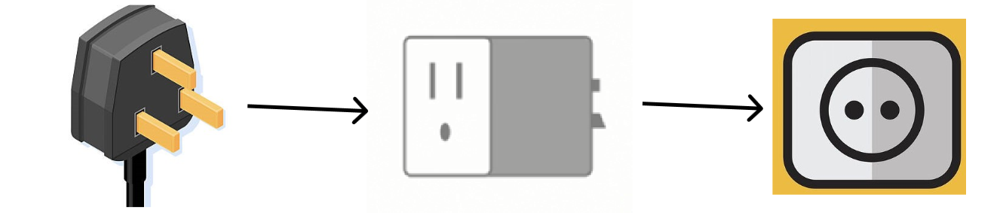

## Adaptor Pattern
Adaptor pattern is act as a Mediatory between two interfaces. It makes the interface of one class compatible with another interface.

### Explanation ⚡
To simplify above mention detail let's consider we have a [2 pin socket](https://clipsal.com.pk/image/cache/catalog/N_Products/E8415U-500x515-500x515.jpg) and we want to put a [3 pin plug](https://www.helptechco.com/files/3-Pin-Plug.jpg) in it, can we do that? OfCourse we can't, but we can use a 2 pin [electric adaptor](https://static-01.daraz.pk/p/8f4d517efff9f9879d361ff2399480b5.jpg) to make it work as shown in diagram.

The adaptor act as a middle man to make two different mediums feasible for for each other. If we talk about this in terms of softwares. The adapter pattern has following specifications:

- __Target Interface:__ This is the desired interface class which will be used by the clients.

- __Adapter class:__ This class is a wrapper class which implements the desired target interface and modifies the specific request 
available from the Adaptee class.

- __Adaptee class:__ This is the class which is used by the Adapter class to reuse the existing functionality and modify them for desired use.

- __Client:__ This program that will interact with the target interface.

The above example in UML format:

