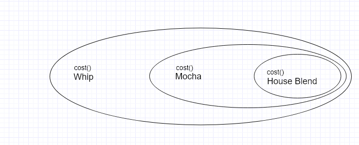
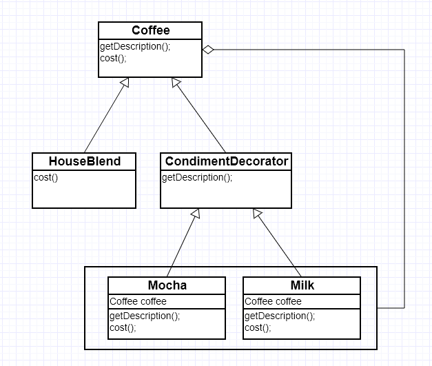
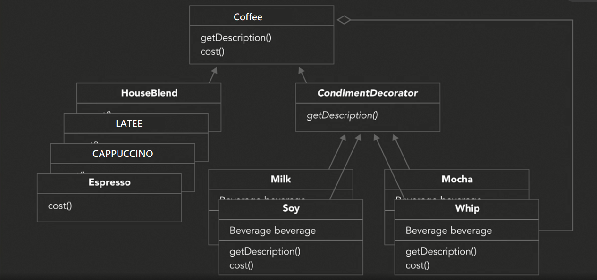

## Decorator Pattern
Decorator patterns are a design pattern that allows to dynamically add a behavior or a functionality to an object without impacting the behavior of the existing objects.

### Explanation ⚡

To understand the decorator pattern let's suppose we are designing a coffee order system and a user can order 4 type of coffees _House Blend_, _Cappuccino_, _Espresso_ and _Latte_ and we can add different condiments like _Soy_, _Milk_, _Whip_, _Mocha_ with each of this type of coffee. As it's an order system it will calculate the total price of the order with the condiments added.

#### Why inheritance is not a good option?
It seems the inheritance might be a good way to implement this design there would be a coffee base class and types are derived from it, but it's not. The problem is that the order system will be dependent on the coffee type and the condiments and there are number of possible ways to order a coffee e.g someone order a house blend with soy and milk added or may be with double soy and mocha. So inheritance make it quite hard to deal with such number of combinations, The design would become a mess. If we take a visual look, this design might look like this(keeping in count only one possibility). 

As we can see inheritance is not a good option as it would be a mess to deal with all the possible combinations. We need something more flexible and easy to extendable design. Loosely talking something like the diagram below, if you notice its very flexible and we can easily add multiple condiments.

As from the definition of the decorator pattern it is used to dynamically add functionalities or behavior to an object without affecting the previous objects. In our case, condiments would be the functionality(decorators) which we want to add dynamically to calculated the final cost without affecting the previous calculated cost of the coffee. The diagram representation of this would be like this. 

Now we can add number of combinations with ease. The extended version of the above diagram would be like this

 