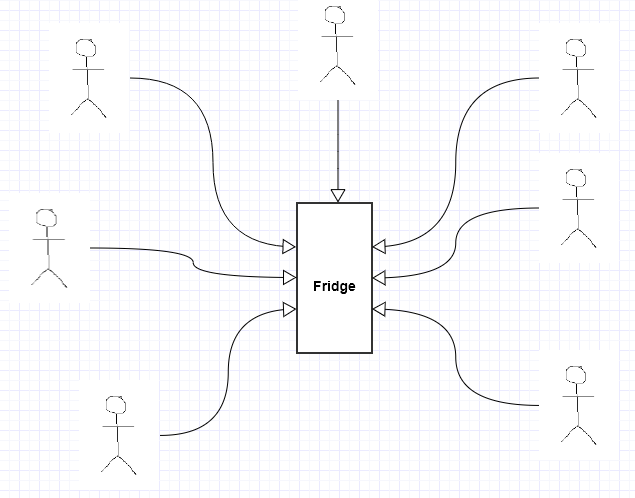

## Singleton Pattern
Singleton is a design pattern that lets you ensure that a class has only one instance, while providing a global access point to this instance. This is useful when exactly one object is needed to coordinate actions across the system.

### Explanation ⚡
To simplify this pattern let's consider an example of a fridge. In most cases, a house has only one fridge but that fridge is used by all the members of the house. According to current scenario the fridge is the single instance that is global to all the users/components. So anyone can access it.  

If you take a close look you might notice that all the users/components uses that single instance so, it may cause coupling and might lead to some problems. So, we always try to avoid overuse of singleton pattern and only use it in the cases where it is really necessary. 
