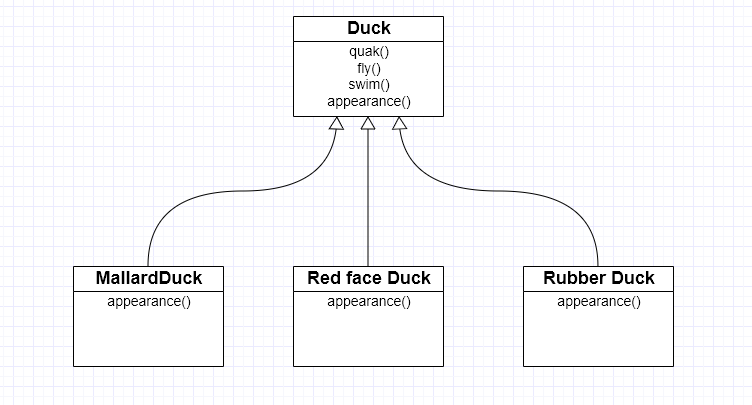
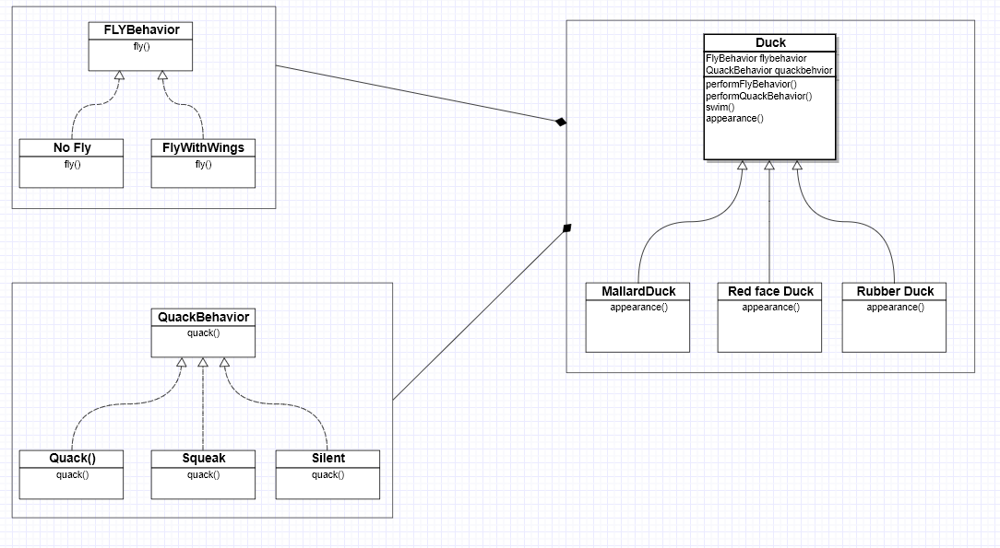

## Strategy Pattern

The Strategy Pattern is a design pattern that defines a family of algorithms by encapsulating those components that varies time to time in separate classes that makes them interchangeable and extendible without modifying the client that uses it.

### Explanation

To understand the Strategy Pattern in detail, let's look at an example:

Consider we are designing a duck simulator where user can simulate different type of ducks. If we go on regular basis, we would create a parent class, Duck that has 4 methods quack(), fly(), swim() and, appearance() and then derives different types of duck classes from it, as the appearance is different for different ducks we will make appearance an abstract method, so it can be override in child classes, as shown in diagram. 

Everything seems perfect, our design seems reusable. But if we take a closer look we can see a rubber duck cannot fly and quack as well, but it squeak. So, to overcome this problem we will override both quack() and fly() method in rubber duck class. Ok great, but what if we want to add another type of duck like [decoy duck](https://en.wikipedia.org/wiki/Duck_decoy_(model)), which cannot quack(as it's a wooden duck) and fly? We have to override them. If you notice, this approach has 2 drawbacks: 
- It effects the reusability.
- It is not flexible, and hard to maintain and extend.

So, How we overcome this problem? here's comes the strategy pattern. According to strategy pattern we encapsulate the varying component in a separate interface and then derive the expected behavior from it in the form of different classes. It enforce has-a relationship now as instead of simple inheritance it would use composition. Our existing class diagram would be like this now.

Now we can easily add new type of duck without modifying the existing classes. We can also extend fly or quack behaviors easily. It ensures reusability, flexibility and maintainability. For a implementation insight, look at the code directory.
